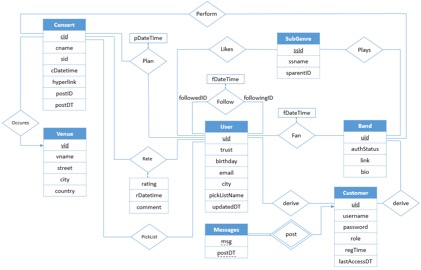
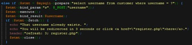
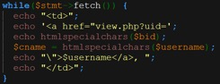
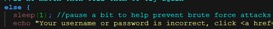

_Last Updated: Fri, Sept 19th, 2015  @ 23:48P_

## Online-Community-of-Live-Music

This application servers two groups -- Fans and Bands. Both fans and bands can post the information about concerts. For coming concerts, users can add them into their plan or recommend them (add them into pick list). For past concerts, users can rate and leave comments with them.

The website has a recommendation system. The recommendation will be based on the background of the users. It also includes many other functions, such as register, post messages, bookmark pages, fan other users, and a simply search engine.

Security are also considered, such as SQL injection, cross-site scripting attacks, and brute force attack for users’ password.

It has been tested on a server based on XAMPP.

____

###E-R DIAGRAM

____

###FUTURE

####Recommendation System
 
 - For Visitors
 
 The content of recommendation will be different for different people. For normal visitors, it generally show the top 5 concerts and bands, because there is no more information we could find from an unknown visitor.
 
 - For Users
 
 For registered users, because we have more information saved in our database, the recommendation could be richer.
Our application will recommend based on all of users he/she followed, bands fanned, and genres liked. Different users will have more personal webpage to have better experience on our website.

 - For Bands
 
 For registered bands, they focused on different aspect against the normal users, so on the home page, we will list their concerts that is latest rated. This will help they immediately know what the fans rated and thought about their concerts.

####Search Engine

  The search function is mainly by keyword in genre. Anyone can search the genre of music they want. The result will list the genre names that contain the keyword.

  Select a genre name, we could see more detail about this genre. The information are grouped by related bands, related concerts, and users with same interesting. Select the one we interested, more action could be made like follow users, pick concerts, fan bands and so on. This is a convenient way for especially new registers to find the useful information from our server.

####Security

 - SQL injection
 
 PHP has the statements PDO::prepare() and PDO::execute() that will be issued multiple times with different parameter values optimizes the performance of my application by allowing the driver to negotiate client and/or server side caching of the query plan and meta information. They could help to prevent SQL injection attacks by eliminating the need to manually quote the parameters.
 
 We use this statement for every query in our codes. There is an example in the register page:
 
 
 
 
 - Cross-site Scripting attacks
 
 PHP also supply htmlspecialchars statement that return a conversion string from special characters in HTML. It replaces < and > with &lt and &gt, which is sufficient to prevent cross-site scripting attacks.
 
 The following is an example we use this statement on Home Page to show usename:

 

 - Brute Force Attacks
 
 After every try to enter pair of username and password, we make the application pause for a while. Under the complex combination of password, attacker will need more time to find the actually password by brute force.
 
 

####Bookmark
 
  Any visitors could bookmark pages for viewing concerts, users, or bands, because we use the GET method to transfer data in those pages. They could save the URLs in order to easily visit in the future.
 
  However in some other pages that contain sensitive data, we use the POST method to transfer data. Even visitor save that pages, they couldn’t do the same thing as before.

####Trust Score

  Each user has a trust score. Its value is determined by the register time, number of rates, number of posts, and etc.
  
  With low trust score, users will have limited behavior, such as they cannot post concerts, rating concerts, or make comments.

____

###AUTHOR

 - [Wayne/ Wei Shan](https://github.com/ishawn)

